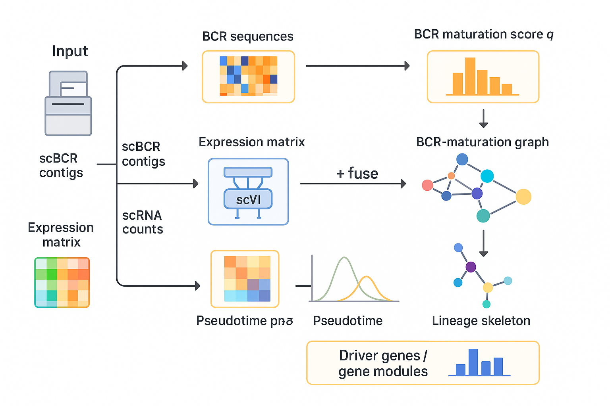

# ClonoTrace

> **BCR-aware single-cell trajectory inference** — from scRNA and raw scVDJ annotations to developmental pseudotime.

<!--badges placeholder – add when repo is public-->
<!-- [](https://pypi.org/project/clonotrace/) -->

---

## Overview



**Figure:** Schematic overview of the ClonoTrace framework. 
The pipeline integrates BCR maturation quality scoring (q-score) with 
single-cell trajectory inference for B cell lineage tracing.

```
Single-cell dataset (scRNA-seq + VDJ)
            │
            ▼
  ┌─────────────────────┐
  │   BCR Quality Score │  ← q_tech_bcr · q_bio_bcr · q_score
  └─────────────────────┘
            │
            ▼
  ┌─────────────────────┐
  │  ClonoTrace Infer   │  ← scVI embeddings · AntiBERTy embeddings · MST · pseudotime
  └─────────────────────┘
            │
            ▼
  ┌─────────────────────┐
  │ Trajectory Analysis │  ← lineage skeletons · fate probabilities · visualization
  └─────────────────────┘
```

ClonoTrace computes a per-cell **BCR maturation quality score (q-score)** that integrates technical confidence and biological maturation signals, then uses it to guide single-cell **trajectory inference** for B-cell development.

---

## Installation

> **Note:** ClonoTrace is not yet on PyPI. Install directly from this repository:
> ```bash
> pip install git+https://github.com/alice-svg/ClonoTrace.git
> ```

### Core dependencies (auto-installed)

```bash
pip install numpy pandas scipy scikit-learn anndata scanpy
```

### Trajectory analysis

```bash
pip install cellrank leidenalg pynndescent harmonypy
```

### Deep learning (AntiBERTy embeddings)

```bash
pip install torch transformers antiberty
```

### Visualization

```bash
pip install matplotlib seaborn networkx
```

### Full install (all dependencies)

```bash
pip install numpy pandas scipy scikit-learn anndata scanpy \
            cellrank leidenalg pynndescent harmonypy \
            torch transformers antiberty \
            matplotlib seaborn networkx \
            biopython tqdm
```

---

## Basic Requirements

**Python** `>= 3.9`

### Required packages

| Group | Package | Version |
|---|---|---|
| Core | `numpy` | >= 2.4.4 |
| Core | `pandas` | >= 2.3.3 |
| Core | `scipy` | >= 1.15.3 |
| Core | `scikit-learn` | >= 1.7.1 |
| Single-cell | `anndata` | == 0.11.4 |
| Single-cell | `scanpy` | == 1.11.4 |
| Trajectory | `cellrank` | == 2.0.7 |
| Trajectory | `leidenalg` | == 0.10.2 |
| Trajectory | `pynndescent` | == 0.5.13 |
| Integration | `harmonypy` | == 0.0.10 |
| Deep learning | `torch` | == 2.10.0 |
| Deep learning | `transformers` | == 4.56.1 |
| Deep learning | `antiberty` | == 0.1.3 |
| Visualization | `matplotlib` | >= 3.10.8 |
| Visualization | `seaborn` | == 0.13.2 |
| Network | `networkx` | == 3.4.2 |
| Network | `python-igraph` | == 1.0.0 |
| Sequence | `biopython` | == 1.86 |
| Utility | `tqdm` | == 4.67.1 |

---

## Quick Start

### Step 1 — Compute BCR q-score

```python
import scanpy as sc
from btraj.qscore.compute_q_score import compute_all_q_scores

adata = sc.read_h5ad("your_data.h5ad")

adata = compute_all_q_scores(
    adata,
    bcr_path="/path/to/cellranger_vdj_outputs/",
)

print(adata.obs[["q_tech_bcr", "q_bio_bcr", "q_score"]].head())
```

Adds three columns to `adata.obs`:

| Column | Description |
|---|---|
| `q_tech_bcr` | Technical confidence from Cell Ranger contig annotations (0–1) |
| `q_bio_bcr` | Biological maturation — isotype, SHM, clonal expansion (0–1) |
| `q_score` | Final aggregated score (0–1) |

**Required inputs:**

- `adata.obs`: `donor_id`, `isotype`, `SHM`, `clone_id`
- Cell Ranger VDJ files under `bcr_path`, named `{donor_id}_all_contig_annotations.csv`

---

### Step 2 — Run trajectory inference

```bash
python run_inference.py \
  --input data/your_data.h5ad \
  --output results/trajectory_results.h5ad \
  --start-type PRE_PRO_B \
  --terminal-types MATURE_B,B1,PLASMA_B \
  --pseudotime-mode q_aware
```

**Required:** `adata.obs` must contain `celltype`, `q_score`, `Heavy`, `Light`; `adata.obsm` must contain `X_scvi`.

**Output:** `trajectory_results.h5ad` with `pseudotime_raw` and `prob_*` fate probability columns.

Key arguments:

| Argument | Default | Description |
|---|---|---|
| `--start-type` | `PRE_PRO_B` | Root cell type |
| `--terminal-types` | `MATURE_B,B1,PLASMA_B` | Terminal cell types |
| `--fate-method` | `direct` | `direct` / `sparse_custom` / `gpcca` |
| `--pseudotime-mode` | `q_aware` | `raw` / `q_aware` |
| `--q-aware-strength` | `balanced` | `fast` / `balanced` / `full` |

---

## Evaluation (optional)

### Q-score stability

```bash
python qscore_bootstrap.py \
  --h5ad results/trajectory_results.h5ad \
  --n-iter 100 \
  --out-dir results/qscore_bootstrap
```

Outputs `qscore_bootstrap.json` (mean ρ, std, 95% CI) and `qscore_bootstrap.pdf`.

### Trajectory quality

```bash
python evaluate_trajectory.py results/trajectory_results.h5ad \
  --pseudotime_col pseudotime_raw \
  --branch_cols prob_MATURE_B,prob_B1,prob_PLASMA_B \
  --label my_run \
  --out_dir results/eval
```

Computes 8 metrics (Spearman ρ, Kendall τ, Branch AUC, etc.) and outputs a graded report (A–F).

### Compare against SOTA pseudotime methods

```python
from evaluate_scoring import evaluate_pseudotime_order

metrics = evaluate_pseudotime_order(
    meta=df,
    pseudotime_cols=["monocle3_pseudotime", "palantir_pseudotime", "ours_pseudotime"],
    order=["PRE_PRO_B", "PRO_B", "LARGE_PRE_B", "SMALL_PRE_B", "IMMATURE_B", "MATURE_B"],
    sort_by="kendall",
    save_path="figs/accuracy.pdf",
)
```

---

## Workflow Summary

```
compute_q_score.py   →  q_tech_bcr, q_bio_bcr, q_score  →  adata.obs
        ↓
run_inference.py     →  pseudotime_raw, prob_*           →  trajectory_results.h5ad
        ↓
qscore_bootstrap.py  →  stability check (Spearman ρ, 95% CI)
        ↓
evaluate_trajectory.py  →  8-metric report (JSON + PNG)
        ↓
evaluate_scoring.py     →  vs. SOTA comparison (PDF)
```

---

## Support

If you have questions, suggestions, or encounter issues, please open an issue in the [issue tracker](https://github.com/your-org/clonotrace/issues).
